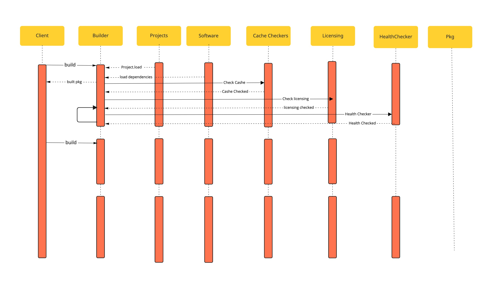

**Omnibus**  

**Omnibus** is a tool for creating full-stack installers for multiple platforms. In general, it simplifies the installation of any software by including all the dependencies for that piece of software.
**Omnibus:–** the framework, created by Chef Software, by which we create full-stack, cross-platform installers for software. The project is on GitHub at 

**Omnibus-software:–** Chef Software’s open-source collection of software definitions that are used to build the Chef Client, the Chef Server, and other Chef Software products. The software definitions can be found on GitHub at   

**Getting Started**  

To get started install omnibus  

```bash
$ gem install omnibus 
```

You can now create an omnibus project inside your current directory using project generator feature 

```bash
$ omnibus new demo 
```

This will generate a complete project skeleton in the directory as following: 

    create  omnibus-demo/Gemfile 

      create  omnibus-demo/.gitignore 

      create  omnibus-demo/README.md 

      create  omnibus-demo/omnibus.rb 

      create  omnibus-demo/config/projects/demo.rb 

      create  omnibus-demo/config/software/demo-zlib.rb 

      create  omnibus-demo/config/software/preparation.rb 

      create  omnibus-demo/.kitchen.local.yml 

      create  omnibus-demo/.kitchen.yml 

      create  omnibus-demo/Berksfile 

      create  omnibus-demo/package-scripts/demo/preinst 

       chmod  omnibus-demo/package-scripts/demo/preinst 

      create  omnibus-demo/package-scripts/demo/prerm 

       chmod  omnibus-demo/package-scripts/demo/prerm 

      create  omnibus-demo/package-scripts/demo/postinst 

       chmod  omnibus-demo/package-scripts/demo/postinst 

      create  omnibus-demo/package-scripts/demo/postrm 

       chmod  omnibus-demo/package-scripts/demo/postrm 

      create  omnibus-demo/resources/demo/pkg/background.png 

      create  omnibus-demo/resources/demo/pkg/license.html.erb 

      create  omnibus-demo/resources/demo/pkg/welcome.html.erb 

      create  omnibus-demo/resources/demo/pkg/distribution.xml.erb 

 


It creates the omnibus-demo directory inside your current directory and this directory has all omnibus package build related files. It is easy to build an empty project without doing any change run 

> bundle install  

The above command will create the installer inside pkg directory. Omnibus determines the platform for which to build an installer based on the platform it is currently running on. That is, you can only generate a .deb file on a Debian-based system. To alleviate this caveat, the generated project includes a Test Kitchen setup suitable for generating a series of Omnibus projects.  

Back to the Omnibus DSL. Though bin/omnibus build demo will build the package for you, it will not do anything exciting. For that, you need to use the Omnibus DSL to define the specifics of your application. 


1) Config 

If present, Omnibus will use a top-level configuration file name omnibus.rb at the root of your repository. This file is loaded at runtime and includes number of configurations. For e.g.- 

2) Project DSL 

When you create an omnibus project, it creates a project DSL file inside config/project with the name which you used for creating project for above example it will create config/project/demo.rb. It provides means to define the dependencies of the project and metadata of the project. We will look at some contents of project DSL file

3) Software DSL
Software DSL defines individual software components that go into making your overall package. The Software DSL provides a way to define where to retrieve the software sources, how to build them, and what dependencies they have. Now let’s edit a config/software/demo.rb 

## Sequence Diagram
Reff: 

**Client**


**Builder**
While calling builder 

**Projects**

**Software**

**Cache Checkers** 

**Licensing**

**HealthChecker**

**PKG**


